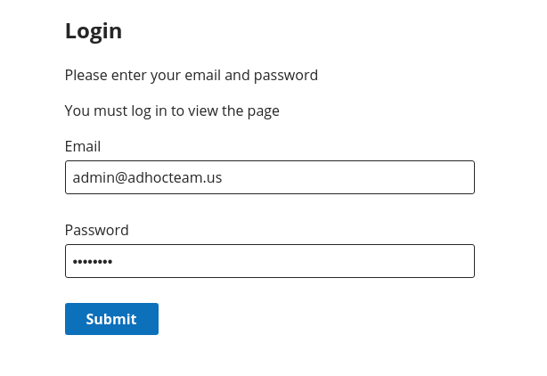
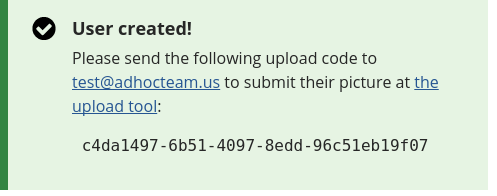
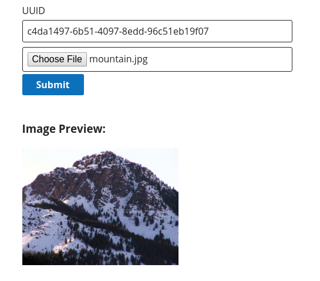
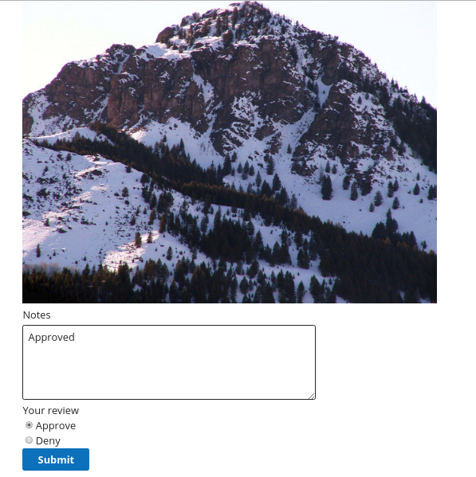

# USCIS-RFDS

A photo upload and review app. Running application can be found [here](https://uscis-rfds.adhocteam.us/). See [usage instructions](#try-it-out)
for login details.

## Technologies Used

* [Ruby on Rails](http://rubyonrails.org/) for REST services.
* [ReactJS](https://reactjs.org/) for the frontend.
* [Docker/Docker Compose](https://www.docker.com/) for containers and workflow management.
* [Terraform](https://www.terraform.io/) for provisioning infrastructure.
* [Jenkins](htps://jenkins.io/) for continuous integration.
* [CMS Design System](https://design.cms.gov/) for design.

See `/ops/README.md` for deployment and CI related information.

## Try it out

1. Head over to https://uscis-rfds.adhocteam.us/
2. [Log-in](https://uscis-rfds.adhocteam.us/login) with username: `admin@adhocteam.us`, password: `password`.

   

3. Create an upload token at [Request an Upload](https://uscis-rfds.adhocteam.us/request). Copy and paste the code generated.
   
4. Submit an image at [Upload Image](https://uscis-rfds.adhocteam.us/) with token generated from the upload request form. Note: Login not required for this page.

   

5. Review submissions in [Review Submission](https://uscis-rfds.adhocteam.us/review). You can filter by the submission type, and write a note approving or rejecting the submission.



## Development

Install docker and docker-compose.

1. Use `.env.sample` to create a `.env` file with your AWS credentials.
2. Run `docker-compose build` to build the containers with dependencies
3. Run `docker-compose run backend rake db:create db:migrate db:seed`
4. Run `docker-compose up` to start the application. The frontend should be served at http://localhost:3000.

Tests can be run via

```
docker-compose run backend rspec
```
