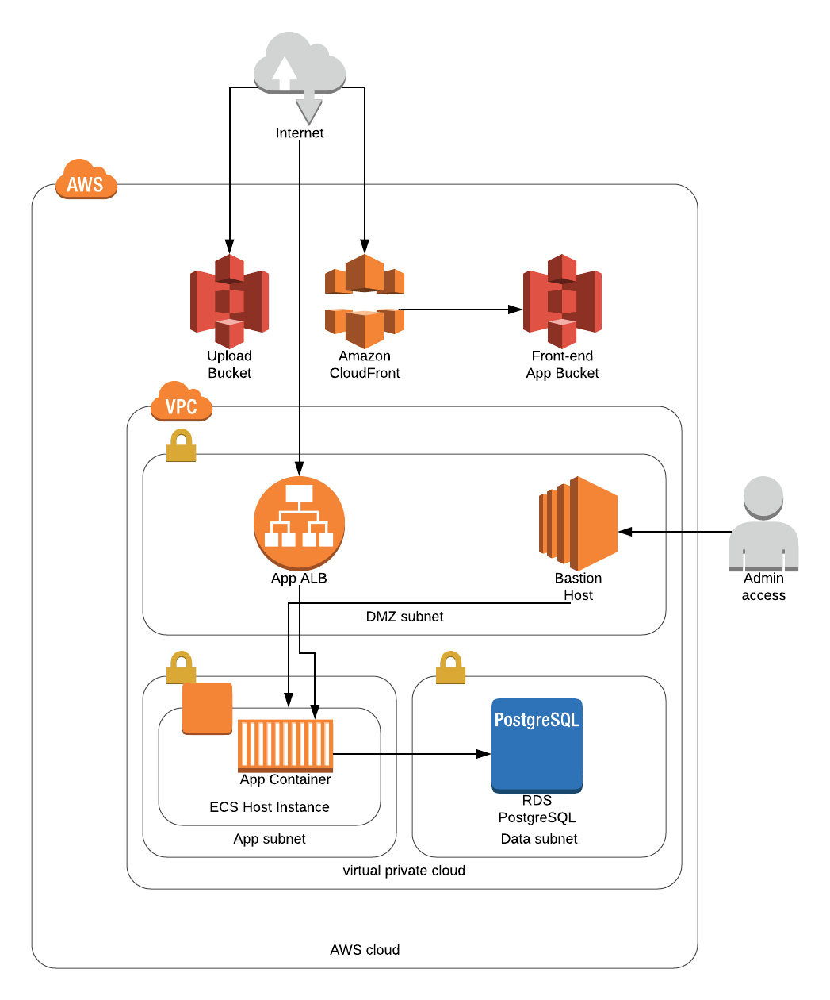

## Deployment infrastructure

### Security overview

#### IAM users, roles and policies

- Ad Hoc adheres to the [Principal of Least Privilege](https://docs.aws.amazon.com/IAM/latest/UserGuide/best-practices.html#grant-least-privilege) regarding IAM users, roles and related policies. Engineers and AWS resources are granted only the privileges required to perform their duties and no more.

#### At the network level

- For the backend app:
  -  EC2 instances and RDS servers reside in private VPC subnets
    - They can not be accessed directly via the public internet
    - Clients or end users access the application via the Application Load Balancer (ALB)
    - When required, admin access to application and database servers is facilitated by a "bastion" server deployed in a public or "DMZ" subnet
  - The Application Load Balancer uses TLS to secure communication between the application and end users
  - Security groups are used to manage communication between AWS resources
    - The public internet can make https requests to the ALB
    - Only the ALB is allowed to make requests to application servers
    - Only application servers are granted access to the database server
    - SSH access to EC2 instances is allowed for team members who possess the appropriate instance key pair
- For the frontend app:
  - The Cloudfront distribution uses TLS to secure communication between the application and end users

#### Configuration management

- All configuration variables used by AWS resources are stored in an S3 bucket and secured at rest using KMS encryption
- Terraform state files are also stored in an S3 bucket an secured at rest using KMS encryption
- Only the Jenkins CI server and a subset of Ad Hoc engineers have access to the KMS key required encrypt and decrypt configuration variables and Terrform state files

#### Jenkins

- Jenkins is deployed to its own VPC
- An Elastic Load Balancer (ELB) is used to proxy requests to the Jenkins backend
- The ELB uses TLS to secure communication between Jenkins and end users/engineers
- Security groups are used to manage communication between AWS resources
  - The public internet can make requests to the ELB
  - Only the ELB is allowed to make requests to the Jenkins server
  - When SSH access to the Jenkins is requried, only team members who possess the appropriate instance key pair are allowed access
- Access to the Jenkins CI/CD server requires a valid username and password

### Steps to bring up infrastructure:

NOTE: At present, the included infrastructure configurations are tightly coupled to Ad Hoc's AWS account.

1. Apply the `bootstrap` configurations:

```
cd ops/terraform/bootstrap
terraform init && terraform apply
```

This creates the s3 bucket and dynamo db table used to store terraform state. The configurations for these resource will not be stored in remote Terraform state.

2. Apply the `global` configurations:

```
cd ops/terraform/global
terraform init && terraform apply
```

This will create the S3 bucket KMS key and related policy to be used for storage of configuration variables and encryption of any sensitive information.

3. Provision the VPC

```
cd ops/terraform/<env>/vpc
terraform init && terraform apply
```

4. Apply the Elastic Container Registry configurations:

```
cd ops/terraform/<env>/ecr
terraform init && terraform apply
```

This will create an ECR to store docker images for the application.

5. Build and push the initial docker image to ECR:

```
cd ops/scripts
./backend-release.sh <env> <version>
```

The `<env>`argument is required. If `<version>` is omitted, the first 12 characters of the most recent commit hash on the `master` branch will be used.

6. Apply the backend application configurations:

```
cd ops/terraform/<env>/backend
terraform init && terraform apply -var service_version=<version> -var 'db_password=<your-password-here>'
```

The value for `<version>` should match what was used in step 4. The value for `db_password` is used for the admin user (i.e., `uscis`) of the postgres database brought up for the backend app.

7. Apply the frontend application configurations:

```
cd ops/terraform/<env>/frontend
terraform init && terraform apply
```

This step creates the S3 bucket and Cloudfront distribution for the front end application.

### Setting up the RDS database

To bootstrap the database:

1. Make sure the appropriate env vars are set for the AWS environment (see: `ops/config`).

The app expects these env vars are defined:

```
DB_USER
DB_PASS
DB_NAME
DB_HOST
DB_PORT
```

2. Build a new image for the backend app (see: [build and deploy scripts](#build-and-deploy-scripts))
3. Login to the ec2 instance where ECS containers are deployed:

```
ssh -i /path/to/key.pem ec2-user@<ip-of-ec2-instance>
```

4. Run the following command:

```
docker run --rm \
    -it --name uscis-db-setup\
    <aws-account-id>.dkr.ecr.<aws-region>.amazonaws.com/<repo-or-image-name>:<version-tag> \
    bundle exec rake db:drop db:create db:migrate
```

Be sure to fill in the appropriate values for `<aws-account-id>`, `<aws-region>`, `<repo-or-image-name>` and `<version-tag>`.

### Build and deploy scripts

Build docker image for backend app:

```
cd ops/scripts
./backend-build.sh <env> <version>
```

This produces the image: `uscis-backend:<env>-<version>`

If no <version> is supplied, the current git commit is used.

To push to the Elastic Container Registry:

```
cd ops/scripts
./backend-push.sh <env> <version>
```

Convenience for running `./backend-build.sh` and `./backend-push.sh`:

```
cd ops/scripts
./backend-release.sh <env> <version>
```

Convenience for deploying a new image to ECS:

```
cd ops/scripts
./backend-deploy.sh <env> <version>
```

The only possible value for <env> is `dev` at the moment.

### Rotating ECS container instances

When a new AWS Linux AMI is released, it is possible to bring new container instances into service to replace the old with zero downtime.

To do this manually:

1. Update the `image_id` attribute using the ID of the latest AWS Linux AMI (ECS-optimized)
2. Double the value for `asg_desired` attribute of the application's app module
3. Apply the changes (modifying `<version>` and `<db_password>` with the appropriate values):

```
cd ops/terraform/dev/backend
terraform apply -var service_version=<version> -var db_password=<db_password>
```

4. Wait for the autoscaling group to launch a new instances using the updated AMI ID
5. When the instances are healthy, double the value of `task_count` attribute of the applications app module
6. Apply the changes by rerunning the `terraform apply` command from step 3 above
7. When the ECS service "Desired count" matches the value for `task_count` and all tasks and instances are healthy, restore the original value for `asg_desired` and apply changes. Then, restore the original value for `task_count` and apply changes. ECS will remove the old tasks and the autoscaling group will remove the old ec2 instances.

TODO: automate this process.

## Jenkins

### Terraform

The included configs will provision:

- A separate VPC for housing Jenkins-related resources
- An ec2 instance to run Jenkins
- 2 EBS volumes
    - One for Docker (storage of images and writeable layers)
    - One for persistence of Jenkins' home directory

To bring up Jenkins infrastructure:

```
cd ops/terraform/jenkins
terraform apply
```

### Ansible playbook

The included Ansible playbook:

- Installs Docker and Nginx on the ec2 instance brought up in the previous step
- Configures the EBS volumes attached to the instance
- Bakes a custom Jenkins image (based on the official [Jenkins Docker image](https://hub.docker.com/r/jenkins/jenkins/)) with our requirements
- Starts (or restarts) the Jenkins container and Nginx

To use the playbook, grab the public IP address of the ec2 instance from the previous step, run the following commands:

```
cd ops/playbooks
ansible-playbook -i "<public_ip_address>," jenkins.yml
```

### Custom Jenkins Docker Image

Extra utilities and dependencies can be added to the Jenkins image so that they may be used in Jenkins jobs.

Add new requirements to: `/ops/playbooks/files/Dockerfile`

Note that the Jenkins image we're using `jenkins:lts-alpine`. You'll need to use `apk add ...` to install new packages or add to/modify `/etc/apk/repositories` to source packages that are not available by default.

Further note that installing package requires the `root` user in the alpine image. So, make sure any additions to the Dockerfile happen in between `USER root` and the switch back to `USER jenkins`.

Example -- installing the aws cli tools:

```
RUN apk add --no-cache py-pip && \
    pip install awscli
```

### Appendix A - Architecture Diagram

